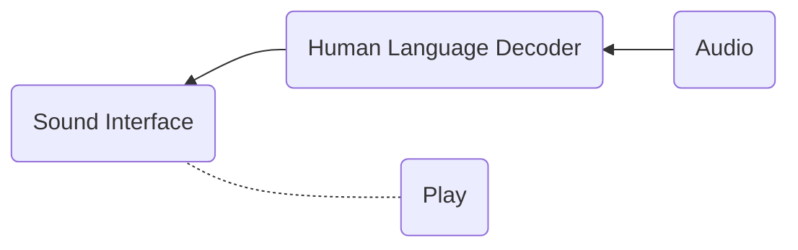

## CogArch
This project is a collection of techonologies that seem promising for a proper "cognitive architecture". Very much a work in progress, demonstrated here is the following.

### Organization
This is what there is so far. Premissed on the intuition that a cognitive architecture must have some kind of interface with the sensory world, `Audio` uses `pyaudio` to record sound. Then the "human language decoder" uses `whisper` to make sense of the sound (by windowing the incoming data with a stride of the size of the window), a string of "words". This is what constitutes the sound interface for this cognitive architecture so far - basically the "phonological" component from linguistics. (`Play` is (unjustified) playback of the architecture's "sonic memories".)




A theoretical justification for inclusion of a "human language decoder": No cognitive architecture should be expected to understand human (externalized) language, as a uniquely human-species product. And yet development of a cognitive architecture means the architecture is around - almost _socialized_ by - humans, their makers. An interface with sound might be one that operates those frequencies of sound that are important or information-rich, and those frequencies are likely those expressing human language.

Whatever internal "language" the architecture will have, it will be related to the sound interface. It might make sense to operate on human language _detection_ (one output of `whisper`) - and potentially further, on constructions of word-like chunks. If the words are in turn used in the architectures language, it will likely be part of a protocol (for dealing with humans).

### Running
Set up a python virtual environment with the dependencies (`whisper`, `pyaudio`, `wave`, `whisper`'s `torch`, and so on).
```
python3 sound_interface.py
```
